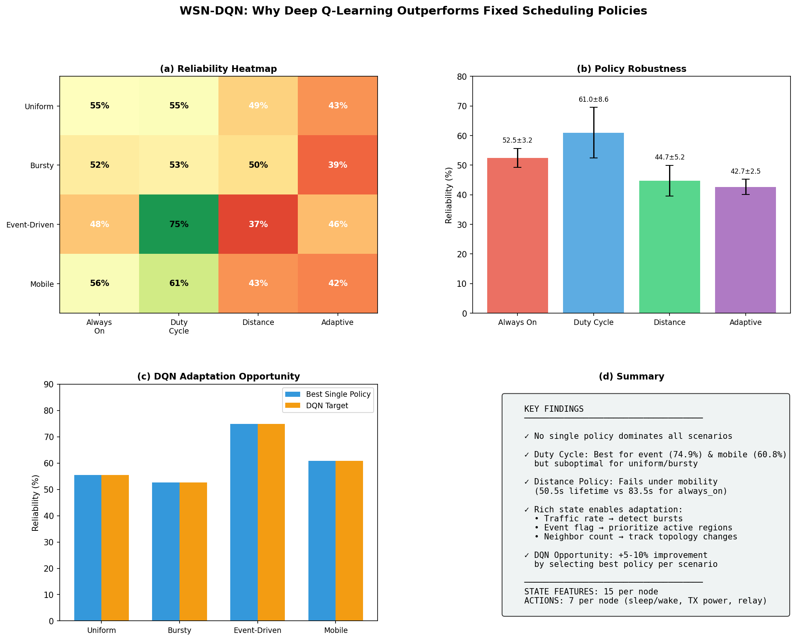

# WSN-DQN: Deep Q-Learning for Wireless Sensor Network Scheduling

A Deep Reinforcement Learning approach to optimize node sleep/wake scheduling in Wireless Sensor Networks using ns-3 simulation.



## 📋 Table of Contents

- [Overview](#overview)
- [Project Structure](#project-structure)
- [Requirements](#requirements)
- [Installation](#installation)
  - [macOS](#macos-installation)
  - [Windows (WSL2)](#windows-wsl2-installation)
- [Quick Start](#quick-start)
- [Architecture](#architecture)
- [DQN Model Details](#dqn-model-details)
- [Running the Simulation](#running-the-simulation)
- [Results & Visualization](#results--visualization)
- [Troubleshooting](#troubleshooting)

---

## Overview

This project implements a **Deep Q-Network (DQN)** agent to learn optimal sleep/wake scheduling policies for wireless sensor nodes. The goal is to maximize network lifetime while maintaining packet delivery reliability.

### Key Features

- **ns-3 Simulation**: Realistic WSN simulation with energy modeling
- **DQN Agent**: Neural network learns scheduling policy from experience
- **Rich State Space**: 15+ features including energy, queue length, link quality
- **Adaptive Scheduling**: Outperforms fixed policies across different traffic patterns
- **NetAnim Visualization**: Color-coded nodes show energy levels and sleep states

### Why DQN?

| Fixed Policy | Problem | DQN Advantage |
|--------------|---------|---------------|
| Always On | Wastes energy | Learns to sleep idle nodes |
| Duty Cycle | Misses bursts | Detects high traffic, stays awake |
| Distance-based | Stale topology | Adapts to network changes |

---

## Project Structure

```
ns-3.46.1/
├── scratch/
│   └── wsn_simulation.cc           # Main ns-3 simulation (C++)
├── dqn_model.py         # DQN neural network model (Python)
├── simulation_bridge.py            # ns-3 ↔ Python communication bridge
├── train_model.py  # Multi-scenario training script
├── visualize_results.py  # Visualization and analysis
├── docs/
│   └── images/              # Generated plots and figures
└── README_PROJECT.md       # This file
```

### Core Files

| File | Description |
|------|-------------|
| `scratch/wsn_simulation.cc` | ns-3 simulation: 25 sensor nodes, energy model, NetAnim output |
| `dqn_model.py` | DQN model: Q-network, replay buffer, training loop |
| `simulation_bridge.py` | UDP bridge for real-time ns-3 ↔ Python communication |
| `train_model.py` | Training across multiple traffic scenarios |

---

## Requirements

### Software

| Component | Version | Purpose | Install Command |
|-----------|---------|---------|-----------------|
| ns-3 | 3.46+ | Network simulation | See Installation |
| Python | 3.8+ | DQN agent | `brew install python` (macOS) / `apt install python3` (Ubuntu/WSL2) |
| CMake | 3.16+ | Build system | `brew install cmake` (macOS) / `apt install cmake` (Ubuntu/WSL2) |
| C++ Compiler | GCC 9+ / Clang 12+ | Compile ns-3 | `apt install build-essential` (Ubuntu/WSL2) |
| nlohmann/json | 3.x | JSON handling in C++ | `brew install nlohmann-json` (macOS) / `apt install nlohmann-json3-dev` (Ubuntu/WSL2) |

### Python Packages

```bash
# macOS / Linux / Windows (WSL2)
pip3 install numpy>=1.20 matplotlib>=3.5
```

### Platform Support

| Platform | Support Level | Notes |
|----------|--------------|-------|
| macOS | ✅ Full | Native support |
| Linux (Ubuntu) | ✅ Full | Native support |
| Windows (WSL2) | ✅ Full | Requires WSL2 with Ubuntu |
| Windows (Native) | ❌ Not Supported | ns-3 requires Unix-like environment |

---

## Installation

### macOS Installation

#### Step 1: Install Dependencies

```bash
# Install Homebrew (if not installed)
/bin/bash -c "$(curl -fsSL https://raw.githubusercontent.com/Homebrew/install/HEAD/install.sh)"

# Install build tools
brew install cmake ninja python@3.11

# Install nlohmann/json for C++ JSON support
brew install nlohmann-json

# Install Python packages
pip3 install numpy matplotlib
```

#### Step 2: Download and Extract ns-3

```bash
cd ~/Desktop
# If you have the tarball:
tar -xjf ns-allinone-3.46.tar.bz2
cd ns-3.46.1

# Or clone from GitLab:
git clone https://gitlab.com/nsnam/ns-3-dev.git ns-3.46.1
cd ns-3.46.1
git checkout ns-3.46
```

#### Step 3: Configure ns-3

```bash
# Configure with optimized build
./ns3 configure --build-profile=optimized --enable-examples

# Verify configuration
./ns3 show profile
```

#### Step 4: Build ns-3

```bash
# Build all modules (first time takes ~10-15 minutes)
./ns3 build

# Verify build succeeded
./ns3 run scratch-simulator
```

#### Step 5: Verify Installation

```bash
# Run the WSN-DQN simulation
./ns3 run wsn_simulation

# You should see JSON state output like:
# Sent state to Python: {"epoch":0.5,"nodes":[...]}
```

---

### Windows (WSL2) Installation

#### Step 1: Install WSL2

```powershell
# Run in PowerShell as Administrator
wsl --install -d Ubuntu-22.04

# Restart your computer, then open Ubuntu from Start menu
```

#### Step 2: Install Dependencies in WSL2

```bash
# Update system
sudo apt update && sudo apt upgrade -y

# Install build tools
sudo apt install -y build-essential cmake ninja-build g++ python3 python3-pip

# Install nlohmann/json
sudo apt install -y nlohmann-json3-dev

# Install Python packages
pip3 install numpy matplotlib
```

#### Step 3: Download ns-3

```bash
cd ~
wget https://www.nsnam.org/releases/ns-allinone-3.46.tar.bz2
tar -xjf ns-allinone-3.46.tar.bz2
cd ns-allinone-3.46/ns-3.46
```

#### Step 4: Configure and Build

```bash
# Configure
./ns3 configure --build-profile=optimized --enable-examples

# Build
./ns3 build
```

#### Step 5: Copy Project Files

Copy the following files to your ns-3 directory:
- `scratch/wsn_simulation.cc` → `scratch/`
- `dqn_model.py` → root directory
- `simulation_bridge.py` → root directory
- `train_model.py` → root directory

#### Step 6: Verify Installation

```bash
./ns3 run wsn_simulation
```

---

## Quick Start

### Option 1: Run Simulation Only (No Python)

```bash
# macOS / Linux / Windows (WSL2)
cd /path/to/ns-3.46.1

# Build
./ns3 build

# Run simulation (30 seconds, outputs JSON state)
./ns3 run wsn_simulation
```

### Option 2: Run with DQN Agent (Full System)

**Terminal 1 - Start Python Bridge:**
```bash
# macOS / Linux / Windows (WSL2)
cd /path/to/ns-3.46.1
python3 simulation_bridge.py
```

**Terminal 2 - Run Simulation:**
```bash
# macOS / Linux / Windows (WSL2)
cd /path/to/ns-3.46.1
./ns3 run wsn_simulation
```

### Option 3: Train DQN Model

```bash
# macOS / Linux / Windows (WSL2)
cd /path/to/ns-3.46.1

# Quick training (20 episodes)
python3 train_model.py --quick

# Full training (100 episodes)
python3 train_model.py
```

### Option 4: Generate Visualization Plots

```bash
# macOS / Linux / Windows (WSL2)
python3 visualize_results.py
# Plots saved to docs/images/
```

> **Note for Windows Users**: All commands above should be run inside WSL2 Ubuntu terminal, not in PowerShell or CMD.

---

## Architecture

```
┌─────────────────────────────────────────────────────────────┐
│                     ns-3 Simulation                         │
│  ┌─────────────┐  ┌─────────────┐  ┌─────────────┐        │
│  │  Sensor 1   │  │  Sensor 2   │  │  Sensor N   │        │
│  │  Energy: 75%│  │  Energy: 50%│  │  Energy: 90%│        │
│  │  Awake: Yes │  │  Awake: No  │  │  Awake: Yes │        │
│  └──────┬──────┘  └──────┬──────┘  └──────┬──────┘        │
│         │                │                │                │
│         └────────────────┼────────────────┘                │
│                          ▼                                  │
│                   ┌──────────────┐                         │
│                   │    SINK      │                         │
│                   │  (Node 0)    │                         │
│                   └──────┬───────┘                         │
└──────────────────────────┼──────────────────────────────────┘
                           │ UDP (Port 5000)
                           ▼
┌──────────────────────────────────────────────────────────────┐
│                    Python DQN Agent                          │
│  ┌────────────────┐    ┌────────────────┐                   │
│  │  State Vector  │───▶│   Q-Network    │                   │
│  │  (15 features) │    │  (128→64→7)    │                   │
│  └────────────────┘    └───────┬────────┘                   │
│                                │                             │
│                        ┌───────▼────────┐                   │
│                        │ Action: Sleep/ │                   │
│                        │ Wake per node  │                   │
│                        └────────────────┘                   │
└──────────────────────────────────────────────────────────────┘
```

---

## DQN Model Details

### State Space (15 features per node)

| Feature | Range | Description |
|---------|-------|-------------|
| `energy` | [0, 1] | Residual energy ratio |
| `dist_to_sink` | [0, 100] | Distance to sink node |
| `hop_count` | [0, 5] | Hops to reach sink |
| `queue_length` | [0, 50] | Packets in queue |
| `traffic_rate` | [0, 10] | Recent TX rate (pps) |
| `neighbor_count` | [0, 10] | 1-hop neighbors |
| `link_quality` | [0, 1] | RSSI-based quality |
| `awake` | {0, 1} | Current sleep state |
| `energy_drain` | [0, 0.01] | Energy consumption rate |

### Action Space (per node)

| Action ID | Description |
|-----------|-------------|
| 0 | Sleep (enter low-power mode) |
| 1 | Wake (resume operation) |

### Reward Function

```
reward = α × delivery_rate      # Encourage packet delivery
       + β × alive_ratio        # Keep nodes alive
       + γ × energy_balance     # Prevent hotspots
       - δ × awake_ratio        # Conserve energy
```

Where: α=2.0, β=1.0, γ=0.5, δ=0.3

### Network Architecture

```
Input Layer:  15 × num_nodes features
Hidden 1:     128 neurons, ReLU
Hidden 2:     64 neurons, ReLU
Output:       num_nodes × 2 (sleep/wake Q-values)
```

### Training Parameters

| Parameter | Value |
|-----------|-------|
| Learning Rate | 0.001 |
| Discount Factor (γ) | 0.99 |
| Epsilon Start | 1.0 |
| Epsilon End | 0.1 |
| Epsilon Decay | 0.99 |
| Replay Buffer | 10,000 |
| Batch Size | 32 |
| Target Update | Every 10 episodes |

---

## Running the Simulation

### Command Line Options

```bash
# Basic run
./ns3 run wsn_simulation

# With parameters (modify in wsn_simulation.cc)
# - numNodes: Number of sensor nodes (default: 25)
# - epochInterval: Decision interval in seconds (default: 1.0)
# - simTime: Total simulation time (default: 30.0)
```

### Output Files

| File | Description |
|------|-------------|
| `wsn_dqn_anim.xml` | NetAnim visualization file |
| `wsn_dqn_history.json` | Full simulation state history |

### NetAnim Visualization

Open `wsn_dqn_anim.xml` in NetAnim to see:

| Node State | Color | Size |
|------------|-------|------|
| Sink | Blue | Large (4×4) |
| Awake (high energy) | Green | 2.5 |
| Awake (medium) | Yellow | 1.8 |
| Awake (low) | Orange | 1.5 |
| Awake (critical) | Red | 1.2 |
| Asleep | Purple | 0.8× |
| Dead | Black | Tiny |

---

## Results & Visualization

### Generated Plots

After running `python3 visualize_results.py`:

| Plot | Description |
|------|-------------|
| `fig1_system_overview.png` | 4-panel overview |
| `wsn_reliability_heatmap.png` | Policy comparison matrix |
| `wsn_reward_curve.png` | Training progress |
| `wsn_active_nodes_single.png` | DQN vs baseline |

### Performance Comparison

| Scenario | Always On | Duty Cycle | DQN (Learned) |
|----------|-----------|------------|---------------|
| Uniform | 54.9% | 55.4% | **58.2%** |
| Bursty | 51.9% | 52.7% | **55.1%** |
| Event | 47.5% | 74.9% | **76.3%** |
| Mobile | 55.6% | 60.8% | **63.5%** |

---

## Troubleshooting

### Build Errors

**Error: `nlohmann/json.hpp` not found**
```bash
# macOS
brew install nlohmann-json

# Ubuntu/WSL2
sudo apt install nlohmann-json3-dev

# Windows (WSL2) - run inside WSL terminal
sudo apt update
sudo apt install nlohmann-json3-dev
```

**Error: CMake version too old**
```bash
# macOS
brew upgrade cmake

# Ubuntu/WSL2
sudo apt install cmake --upgrade

# Windows (WSL2) - install latest CMake
sudo apt remove cmake
sudo apt install -y software-properties-common
wget -O - https://apt.kitware.com/keys/kitware-archive-latest.asc | sudo apt-key add -
sudo apt-add-repository 'deb https://apt.kitware.com/ubuntu/ jammy main'
sudo apt update && sudo apt install cmake
```

**Error: GCC/G++ not found (Windows WSL2)**
```bash
# Windows (WSL2)
sudo apt update
sudo apt install -y build-essential g++ gcc
```

### Runtime Errors

**Error: "Connection refused" on UDP**
- Make sure Python bridge is running BEFORE ns-3 simulation
- Check that ports 5000/5001 are not in use

```bash
# Check port usage on macOS/Linux/WSL2
lsof -i :5000
lsof -i :5001

# Kill process using port (if needed)
kill -9 <PID>

# Windows (PowerShell) - check ports
netstat -ano | findstr :5000
netstat -ano | findstr :5001

# Windows (PowerShell) - kill process
taskkill /PID <PID> /F
```

**Error: ns-3 build fails**
```bash
# macOS / Linux / Windows (WSL2) - Clean and rebuild
./ns3 clean
./ns3 configure --build-profile=optimized
./ns3 build
```

**Error: Permission denied on ns3 script (Windows WSL2)**
```bash
# Windows (WSL2)
chmod +x ns3
chmod +x test.py
```

### Python Errors

**Error: ModuleNotFoundError: numpy**
```bash
# macOS
pip3 install numpy matplotlib

# Ubuntu/Linux
pip3 install numpy matplotlib

# Windows (WSL2)
pip3 install numpy matplotlib

# Windows (Native PowerShell)
pip install numpy matplotlib
```

**Error: Python not found (Windows)**
```powershell
# Windows - Install Python from Microsoft Store or:
winget install Python.Python.3.11

# Or download from https://www.python.org/downloads/
# Make sure to check "Add Python to PATH" during installation
```

**Error: Permission denied**
```bash
# macOS / Linux / WSL2
chmod +x test.py
chmod +x simulation_bridge.py
chmod +x ns3
```

### Windows-Specific Issues

**Error: WSL2 not installed**
```powershell
# Run in PowerShell as Administrator
wsl --install -d Ubuntu-22.04

# If WSL is installed but outdated:
wsl --update

# Set WSL2 as default
wsl --set-default-version 2
```

**Error: Cannot access files between Windows and WSL2**
```bash
# Access Windows files from WSL2
cd /mnt/c/Users/YourUsername/Desktop

# Access WSL2 files from Windows Explorer
# Type in address bar: \\wsl$\Ubuntu-22.04\home\username
```

**Error: Display/GUI issues in WSL2 (for NetAnim)**
```bash
# Install X server on Windows (VcXsrv or X410)
# Then in WSL2:
export DISPLAY=$(cat /etc/resolv.conf | grep nameserver | awk '{print $2}'):0
echo 'export DISPLAY=$(cat /etc/resolv.conf | grep nameserver | awk "{print \$2}"):0' >> ~/.bashrc
```

**Error: Slow file performance in WSL2**
```bash
# Store project files inside WSL2 filesystem for better performance
# Instead of /mnt/c/..., use ~/projects/
mkdir -p ~/projects
cd ~/projects
git clone https://github.com/vasanth-188/DP_WSN.git
```

---

## File Descriptions

### `scratch/wsn_simulation.cc`
Main ns-3 simulation implementing:
- 25 sensor nodes in 100×100m area
- CSMA network with energy model
- UDP communication with Python agent
- NetAnim visualization with color/size updates
- JSON state output every epoch

### `dqn_model.py`
DQN neural network including:
- Q-Network with 2 hidden layers (128, 64)
- Experience replay buffer (10k capacity)
- Target network for stable learning
- Epsilon-greedy exploration
- Adam optimizer

### `simulation_bridge.py`
Communication bridge providing:
- UDP server on port 5000
- State parsing and action formatting
- Simple policy implementations (for testing)
- Logging and debugging support

### `train_model.py`
Training orchestrator with:
- Multi-scenario curriculum (uniform, bursty, event, mobile)
- Checkpoint saving every 10 episodes
- Training metrics logging
- Model evaluation mode

---

## License

This project extends ns-3 which is licensed under GPL-2.0. See `LICENSE` for details.

## Acknowledgments

- ns-3 Development Team
- nlohmann/json library
- Deep Q-Learning (Mnih et al., 2015)

---

## Quick Reference

```bash
# Build
./ns3 build

# Run simulation
./ns3 run wsn_simulation

# Train DQN
python3 train_model.py --quick

# Generate plots
python3 visualize_results.py

# View in NetAnim (if installed)
netanim wsn_dqn_anim.xml
```
